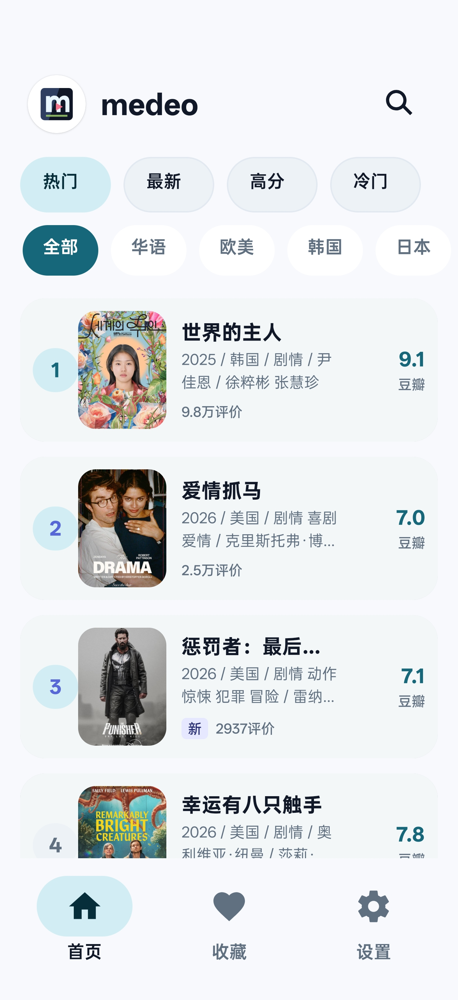
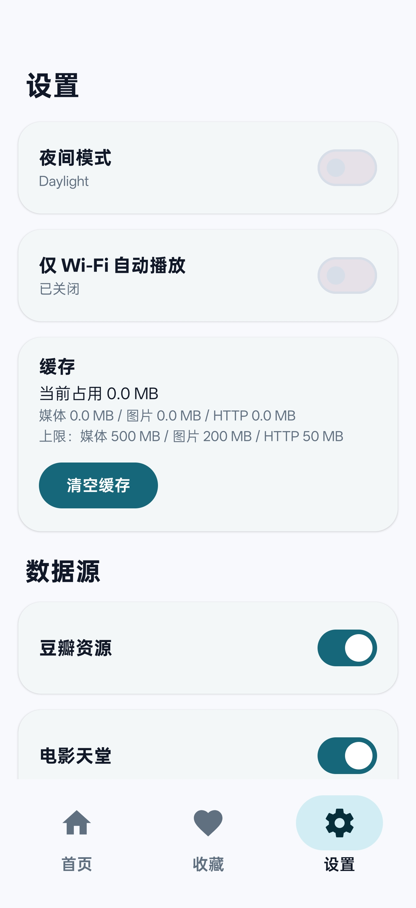

# Medeo

[简体中文](README.md)

Medeo is a native Android media discovery and online playback app for personal sideload use. It provides a Douban-style hot list, multi-source search, source/line/episode switching on detail pages, favorites, watch progress, and Media3/ExoPlayer playback.

> Medeo does not provide media content and does not store, upload, or distribute video files. Search results and playback URLs come from data sources enabled by the user. Make sure you have the required authorization and follow applicable copyright laws and local regulations before accessing any media.

## Screenshots

  
  
  

## Features

- Douban-style hot list for discovering trending titles.
- Concurrent multi-source search where one failing source does not break the rest.
- Detail pages with source, playback line, and episode switching.
- Media3/ExoPlayer playback with HLS support, immersive landscape mode, speed controls, and long-press temporary 2x playback.
- Watch progress saving and continue watching.
- Favorites, local settings, and Day/Night theme switching.
- Source toggles, cache usage, and cache clearing in Settings.
- First-launch disclaimer.

## Open Distribution And Install

This project is intended for self-use sideload installation and is not distributed through app stores. Medeo is distributed through the open-source repository and GitHub Releases; the source is public for review and change tracking, while everyday installation should use the APK published in Releases.

1. Download the APK from GitHub Releases.
2. Allow APK installation from your browser or file manager on the Android device.
3. Launch the app and accept the first-run disclaimer.

System requirement: Android 7.0 or later.

The Android application id is `com.untr.medeo`. If an older package-id build was installed before, this build will not replace it as an in-place update.

## Content And Privacy Boundaries

- The app only stores necessary local metadata such as favorites, watch progress, settings, and cache indexes.
- Video, image, and HTTP caches are kept under the app cache directory and can be cleared from Settings.
- There are no accounts, cloud sync, ads SDKs, or analytics.
- Downloading, exporting, saving to gallery, or sharing video files is not supported.

## Acknowledgements

Thanks to the following open-source projects for inspiration in product direction, interaction design, and the media-app ecosystem:

- [LibreTV](https://github.com/LibreSpark/LibreTV)
- [OrionTV](https://github.com/orion-lib/OrionTV)
- [LunaTV](https://github.com/MoonTechLab/LunaTV)
- [Kazumi](https://github.com/Predidit/Kazumi)

Medeo is an independent Android implementation. This acknowledgement does not imply that code from these projects is bundled in this repository.

## License

This project is licensed under the [MIT License](LICENSE).
