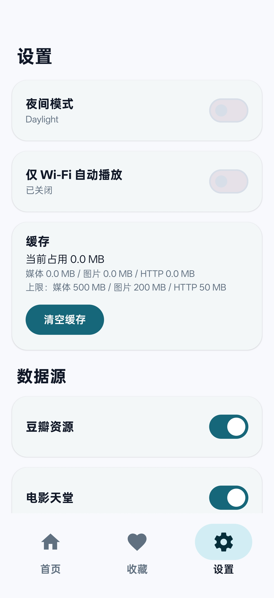

# Medeo

[简体中文](README.md)

Medeo is a personal Android app for discovering and streaming media: browse popular titles, search across sources, pick an episode, and keep favorites and watch progress on your device.

**[Download the latest APK](https://github.com/UntR/Medeo/releases/latest)**

> Medeo does not provide or host media. Search results and playback URLs come from sources enabled by the user.

## Screenshots

  
  
  

## Features

- Browse popular titles or search several sources at once; one unavailable source does not affect the others.
- Switch sources, playback lines, and episodes from the detail page.
- Play HLS video with Media3/ExoPlayer, with landscape mode, speed controls, and temporary 2x playback on long press.
- Keep favorites and watch progress on your device, and manage sources, themes, and caches in Settings.

## Installation

1. Download the latest APK from [GitHub Releases](https://github.com/UntR/Medeo/releases/latest).
2. Allow APK installation from your browser or file manager on the Android device.
3. Launch the app and accept the first-run disclaimer.

System requirement: Android 7.0 or later.

The Android application ID is `com.untr.medeo`. If an older package-ID build is already installed, this build will not replace it as an in-place update.

## Data And Content

- Before using a source, make sure you have the required authorization and follow applicable copyright laws and local regulations.
- Favorites, watch progress, settings, and caches stay on your device; caches can be cleared from Settings.
- There are no accounts, cloud sync, ads, or analytics, and the app does not support downloading, exporting, or sharing video files.

## Acknowledgements

Medeo's product and interactions were inspired by these open-source projects:

- [LibreTV](https://github.com/LibreSpark/LibreTV)
- [OrionTV](https://github.com/orion-lib/OrionTV)
- [LunaTV](https://github.com/MoonTechLab/LunaTV)
- [Kazumi](https://github.com/Predidit/Kazumi)

Medeo is an independent Android implementation and does not bundle or reuse code from these projects.

## License

This project is licensed under the [MIT License](LICENSE).
